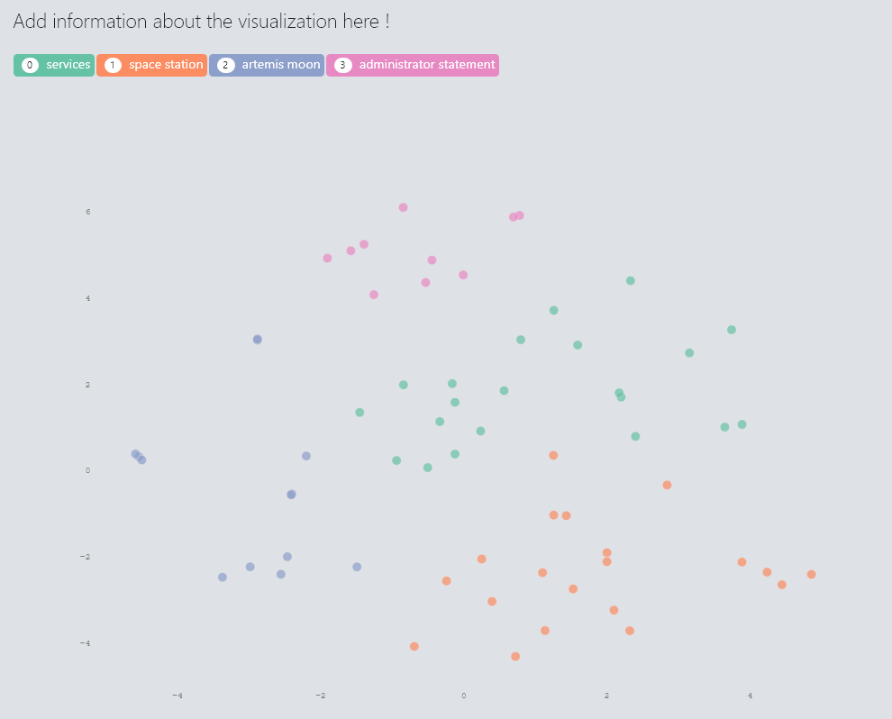

## Introduction

Feed Visualizer is a tool that can cluster RSS/Atom feed items based on semantic similarity and generate interactive visualization.
This tool can be used to generate 'semantic summary' of any website by reading it's RSS/Atom feed. Shown below is an image of how the visualization generated by Feed Visualizer looks like. If you like this tool please consider giving a ⭐ on github !


Interactive Demos:
* Visualization created from [Martin Fowler's Atom Feed](https://martinfowler.com/feed.atom) :
[https://ashishware.com/static/martin_fowler_viz.html](https://ashishware.com/static/martin_fowler_viz.html)

* Visualization created from [BCC's RSS Feed](http://feeds.bbci.co.uk/news/rss.xml) :
[https://ashishware.com/static/bbc_viz.html](https://ashishware.com/static/bbc_viz.html)

## Quick Start

Clone the repo

```bash
git clone https://github.com/code2k13/feed-visualizer.git
```

Navigate to the the newly created directory
```bash
cd feed-visualizer
```

Install the required modules
```bash
pip install -r requirements.txt
```


> Typically a RSS or Atom file only contains recent information from the website. This is where, I would highly recommend using [wayback_machine_downloader](https://github.com/hartator/wayback-machine-downloader) tool. Follow the instructions on this page to install the tool.

The below command downloads public RSS feed from [NASA](https://www.nasa.gov/rss/dyn/breaking_news.rss) for last few months and saves to folder named 'nasa'
```bash
wayback_machine_downloader https://www.nasa.gov/rss/dyn/breaking_news.rss -s -f 202101 -t 202106  -d nasa 
```
> Alternatively you can simply create a new folder  and paste all RSS or Atom files in it (if you have them) ! Make sure to point your config to this folder (read next step)


Now, we need to create a config file for Feed Visualizer. The config file contains path to input directory, name of output directory and some other settings (discussed later) that control the output of the tool. This is what a sample configuration file looks like :

```json
{
    "input_directory": "nasa",
    "output_directory": "nasa_output",
    "pretrained_model": "all-mpnet-base-v2",
    "clust_dist_threshold": 4,
    "tsne_iter": 8000,
    "text_max_length": 2048
}
```

Now its time to run our tool

```bash
python3 visualize.py -c config.json
```

Once the above command completes, you should see  *visualization.html* and *data.csv* files in the output folder (nasa_output). Copy these files to a webserver (or use a dummy server like [http-server](https://www.npmjs.com/package/http-server) ) and view the visualization.html page in a browser. You should see something like this:




## Config settings

Here is some information on what each config setting does:

```json
{
    "input_directory": "path to input directory. Can contain subfolders. But should only contain RSS  or Atom files",
    "output_directory": "path to output directory where visualization will be stored. Directory is created if not present. Contents are always overwritten.",
    "pretrained_model": "name of pretrained model. Here is list of all valid model names https://www.sbert.net/docs/pretrained_models.html#model-overview",
    "clust_dist_threshold": "Integer representing maximum radius of cluster. There is no correct value here. Experiment !",
    "tsne_iter": "Integer representing number of iterations for TSNE (higher is better)",
    "text_max_length": "Integer representing number of characters to read from content/description for semantic encoding."
}
```

## Issues/Feature Requests/Bugs

You can reach out to me on  [👨‍💼 LinkedIn](https://www.linkedin.com/in/ashish-patil-66bb568/) and [🗨️Twitter](https://twitter.com/patilsaheb) for reporting any issues/bugs or for feature requests ! 
